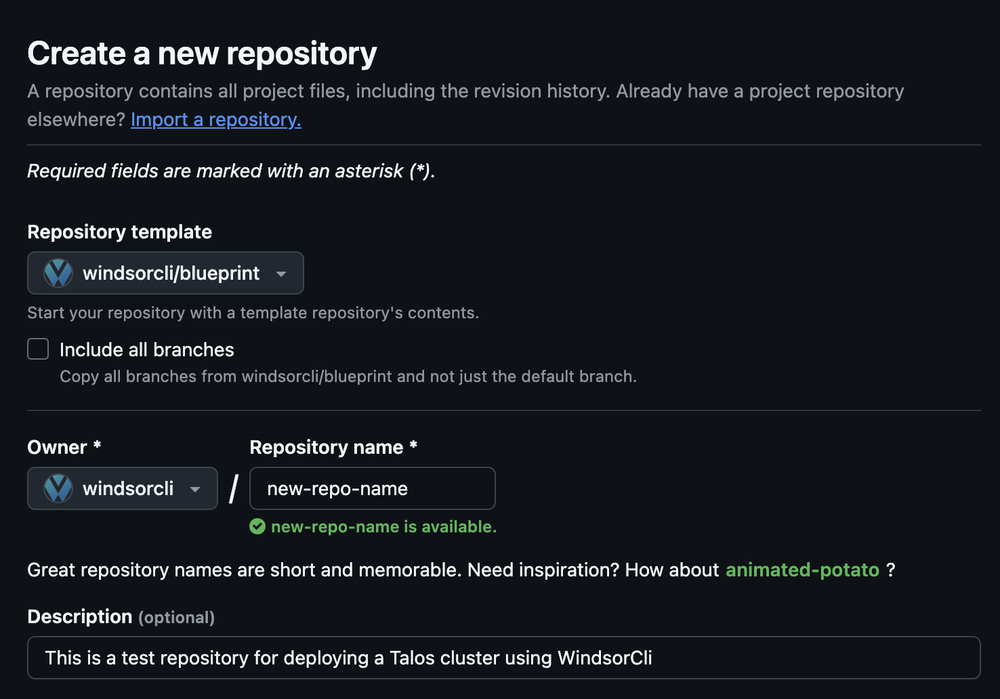

# Blueprint Guidelines

A "Windsor Blueprint" is a repository, a conceptual model of a cloud infrastructure, and a test harness for testing the infrastructure.

The Windsor Blueprint includes the necessary configuration, secrets, code, tests, and documentation to support the deployment of production grade cloud infrastructures.

The Windsor Blueprint repository represents the file structure of a "blueprint" and is used as a template to create new blueprint repositories.  

## Blueprint Repository Structure

A typical blueprint contains many of the files and folders shown here.  Not all of these files and folders will exist in every blueprint repository.  It is permissible and expected that unused files are removed after templating a new blueprint repository.

```
.
├── LICENSE                   // Standard files
├── README.md
├── Taskfile.yaml             
├── aqua.yaml                 // Dependency files
├── pyproject.toml
├── terraform                 // Code
├── kustomize
├── docs                      // Documentation
├── test                      // Test
└── .github                   // CI/CD
  ├── workflows
  |   ├── ci.yaml
  |   ├── enforce-pr-labels.yaml
  |   └── release-drafter.yaml
  ├── release-drafter.yml
  └── renovate.json
```

### Standard Files

The standard files include the LICENSE file and the README.md. 

### Dependency Files

aqua.yaml and pyproject.toml are the default dependency files.

The dependency files contain tool and package dependency information.  The default dependency tools used in the blueprint is Aqua for tool version management and Poetry for python package management.

### Code

The cloud infrastructure code is defined in the terraform and/or the kustomize folders. 

### Documenation

The documentation is created in markdown language and typically is included in a larger documentation deployment.  Internal tools such as the windsorcli.github.io repository are used to deploy the documentation to the gh-pages.

### Test

The test folder contains all the tests that are executed each time the repository is changed.

### CI/CI

The CI/CD files contain github actions

- Automated testing (unit/integration/performance)
- Linting and style checks
- Code scans
- PR Labeling Rules
- Release drafting
- Renovate

# Conceptual Model of a Blueprint

The main idea behind a "blueprint" is to standardize the look and feel of blueprints and to maintain good standards.  By defining a consistent file structure among blueprints allows tool such as the Windsor CLI to make assumptions about which environment variables should be active depending on where the cursor is in the file structure.  The "Blueprint" is the file structure that the Windsor CLI assumes when preparing environment configuration, generating configuration files, and other tasks to assist with context aware command execution.

Blueprint customization is done in the terraform and kustomize folders.  Each blueprint contains documentation in the docs foler, the tool configuration is in an aqua.yaml or asdf.yaml file, and the context specific content is stored under the contexts folder.

# Creating Windsor Blueprints

It's not necessary to create a new blueprint using the blueprint as a template.  Running the 'windsor up' command will generate any files that are necessary, so you can just start windsor wherever in your file system you already have a project for example.  You can also use the blueprint repository as a template repository for a new repo.  We recommend you just start with a new repo and deploy a test cluster at first.  

## Creating a repository from a template
See [Creating a repository from a template](https://docs.github.com/en/repositories/creating-and-managing-repositories/creating-a-repository-from-a-template) to

The nice thing about creating the repository from a template is that the new repository gains the code checking and scanning capabilities right from the start.  

A blueprint repository is a source code repository that is structured according to the blueprint guidelines.  Each blueprint repository will contain some or most of the contents of the blueprint template and will be in compliance with blueprint guidelines. 

